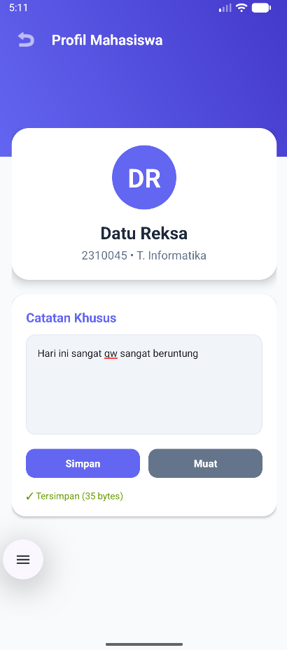
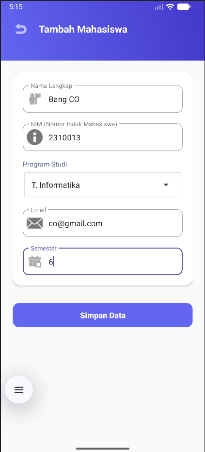

# T4_Praktikum_Mobile

Nama    : Datu Reksa Hamza Putra 
NIM     : F1D02310045

=== Deskripsi Aplikasi ===
  Student Contact App adalah aplikasi manajemen direktori mahasiswa berbasis Android yang memungkinkan pengguna mengelola data kontak secara digital menggunakan database Room serta menyimpan catatan internal dalam bentuk file. Aplikasi ini dilengkapi dengan fitur login sesi, pencarian data real-time, dan pengaturan profil pengguna yang dikemas dalam antarmuka modern untuk memudahkan pengorganisasian informasi akademik secara efisien dan aman.

=== Metode penyimpanan yang digunakan ===
- Room Database: Mengelola data terstruktur mahasiswa (CRUD & pencarian cepat).
- Internal Storage: Menyimpan catatan teks mandiri per mahasiswa secara fleksibel.
- SharedPreferences: Menyimpan sesi login dan preferensi aplikasi secara praktis.

=== Kendala dan Solusi ===
Konfigurasi Sistem: Terjadi kegagalan sinkronisasi karena properti AndroidX belum aktif dan versi Gradle yang tidak sesuai.

Solusi: Mengaktifkan android.useAndroidX di gradle.properties dan memperbarui versi Gradle Wrapper ke 8.13.

== Screenshot ==
1. 
2. 
3. 
4. 
   
